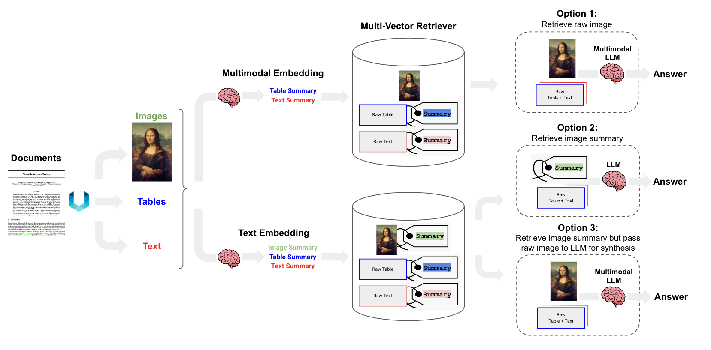

# Paper RAG: Análise Multimodal de Documentos PDF

Este projeto implementa um sistema de RAG (Retrieval-Augmented Generation) multimodal capaz de analisar e responder a perguntas sobre o conteúdo de arquivos PDF, incluindo textos e imagens.

## Arquitetura e Decisões Técnicas

A solução foi desenhada para lidar com a natureza complexa e multimodal de documentos acadêmicos e relatórios. Abaixo estão detalhadas as principais decisões de arquitetura.

### 1. Extração e Particionamento de Dados (`unstructured`)

- **Decisão:** Utilizar a biblioteca `unstructured` para a extração de conteúdo do PDF.
- **Justificativa:** A `unstructured` é especializada em extrair e particionar dados de documentos complexos. Foi utilizada a estratégia `hi_res` para uma análise de layout precisa, e a `chunking_strategy="by_title"` para agrupar o conteúdo de forma semanticamente coesa, respeitando a estrutura de seções do documento. Isso é fundamental para manter o contexto durante a etapa de recuperação.

### 2. Geração de Resumos (Multi-vector Retriever)

- **Decisão:** Adotar uma abordagem de *Multi-vector Retriever*, onde, em vez de vetorizar os chunks brutos, resumos de cada chunk (seja texto ou imagem) são gerados e vetorizados.
- **Justificativa:** Resumos são mais densos em informação e capturam a essência do conteúdo original. Vetorizar resumos permite que a busca semântica seja mais precisa, focando nos conceitos-chave em vez de se perder em detalhes.
    - **Textos:** O modelo `gpt-4o-mini` foi usado para gerar resumos concisos dos trechos de texto e .
    - **Imagens:** O mesmo modelo, em seu modo multimodal, foi empregado para gerar descrições detalhadas das imagens, transformando o conteúdo visual em texto pesquisável.

### 3. Armazenamento e Indexação Vetorial (`ChromaDB`)

- **Decisão:** Utilizar o `ChromaDB` para armazenar os vetores dos resumos e o `FileSystemStore` da LangChain para mapear os IDs dos vetores aos documentos originais.
- **Justificativa:** O `ChromaDB` é uma solução de banco de dados vetorial eficiente e fácil de integrar. A combinação com o `FileSystemStore` cria um mecanismo robusto onde a busca é feita sobre os resumos, e o resultado permite recuperar os chunks originais (texto ou imagem) para serem usados no contexto final. Os índices são persistidos no diretório `./indexes`, permitindo a reutilização sem a necessidade de reprocessar o documento a cada execução.

### 4. Modelos de Linguagem e Embeddings (OpenAI)

- **Decisão:**
    - **Embeddings:** `OpenAIEmbeddings` para gerar os vetores dos resumos.
    - **LLM:** `gpt-4o-mini` para as tarefas de resumo e para a geração final da resposta na cadeia RAG.
- **Justificativa:** Os modelos da OpenAI oferecem um excelente balanço entre performance e custo. O `gpt-4o-mini` é particularmente vantajoso por suas capacidades multimodais e pela alta qualidade tanto na compreensão e resumo de conteúdo quanto na geração de respostas coesas e contextualmente relevantes.

### 5. Orquestração da Cadeia RAG (`LangChain`)

- **Decisão:** Utilizar o LangChain para orquestrar todo o fluxo do RAG.
- **Justificativa:** O LangChain simplifica a integração entre os diferentes componentes (extrator, LLMs, banco de dados vetorial) e permite a construção de cadeias complexas de forma declarativa e modular.

## Fluxo do Processo

1.  **Indexação (Jupyter Notebook):**
    1.  O PDF é processado e dividido em chunks de texto e imagens.
    2.  Resumos são gerados para cada chunk.
    3.  Os resumos são vetorizados e armazenados no `ChromaDB`.
    4.  Um mapeamento entre os resumos e os chunks originais é salvo no `FileSystemStore`.
2.  **Consulta (predict.py):**
    1.  A pergunta do usuário é recebida.
    2.  O retriever busca nos vetores dos resumos os mais relevantes para a pergunta.
    3.  Os chunks originais (texto e imagens) correspondentes aos resumos encontrados são recuperados.
    4.  Esses chunks são injetados em um prompt, juntamente com a pergunta original.
    5.  O `gpt-4o-mini` gera a resposta final com base no contexto fornecido.

## Como Executar

1.  **Instale as dependências:**
    ```bash
    pip install -r requirements.txt
    ```
2.  **Configure suas chaves de API:**
    - Crie um arquivo `.env` na raiz do projeto e adicione sua chave da OpenAI:
      ```
      OPENAI_API_KEY="sua_chave_aqui"
      ```
3.  **Gere os Índices:**
    - Execute o notebook `notebooks/langchain_multimodal.ipynb`. Isso irá processar o PDF e salvar os índices no diretório `./indexes`.
4.  **Converse com o Documento:**
    - Execute o script de predição:
      ```bash
      python predict.py
      ```